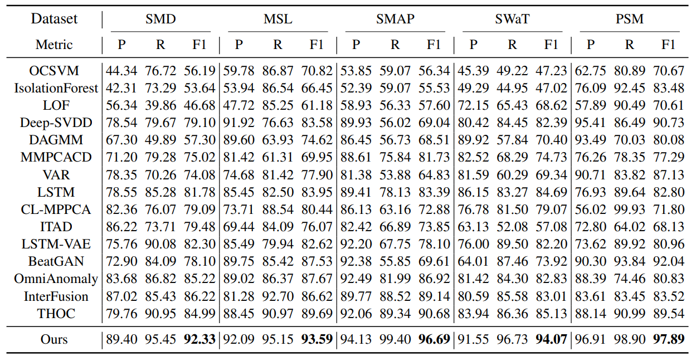

# Anomaly Transformer (ICLR 2022, Spotlight)
- Paper Link: https://arxiv.org/pdf/2110.02642

- Github link: https://github.com/thuml/Anomaly-Transformer/tree/main

## Assumption
Due to the continuity of time series, not only the point anomalies are given, but also anomaly segments are given. Authors assume that anomalies are strongly related to each other, but weakly related to noraml data. They suggest the additional attention layer based on the Gaussian kernel, which is named Anomaly Attention. This is the layer that calculates the attention score between data within the window, which is called Prior-Association. By the assumption on anomalies, anomalies have the high prior association, whereas the normal data don't. The Series-Association, is just the attention score of the vanilla transformer.

Also, authors suggests the novel anomaly score, which is called Association Discrepancy (AssDis). This is calculated as the symmetrized KL divergnce between Prior- and Series- Associations. As the PA/SA of anomaly is high/low and the PA/SA of normal data is medium/medium, the AssDis of anomalies will be lower that that of the normal ones. The training chooses minimax strategy.

Using the point-adjustment strategy, the model achieved the state-of-the-art performance compared to its baselines:

## Issues
But, it seems that it doesn't generalize to the dataset where there is no anomaly segment, like credit card fraud dataset. In this dataset, the anomaly ratio is 0.2%, and there is no anomaly segment. I added the dataloader for the dataset as follows:

- Since the dataset is composed of only one csv file, I split the data into train set and test set, where the former is former 80% of the data, and the latter is latter 20% of the data.

- Splitting data, processing data follows the original code of ./solver.py. Also I added additional part for splitting the test set into data and label.

I first ran ./main.py setting that the anomaly ratio as 0.02. This is similar to the way of setting the anomaly ratio in the paper. After that, I set that the anomaly ratio as 0.2. In both process, Precision, Recall, and F1-score were 0.0000, which says that Anomaly Transformer may have generalizability issue when it comes to the time series dataset that there is little (or no) anomaly segment.

Also, when the point-adjustment algorithm is not applied, the F1 score was severely low, compared to the F1 when PA was applied. This is the results on the banchmark datasets:

| Dataset | F1-PA | $\text{F1}_{PA}$ (Paper) | F1 |
| :-----: | :-----: | :-----: | :-----: |
| PSM | 0.9760 | 0.9789 | 0.0210 |
| MSL | 0.9418 | 0.9359 | 0.0201 |
| SMAP | 0.9636 | 0.9669 | 0.0111 |
| SMD | 0.9088 | 0.9233 | 0.0213 |
| SWaT | 0.9334 | 0.9407 | 0.0245 |

This shows that the F1 score underestimates the model performance when used with no adjustment; oversetimates the model performance when PA is applied.